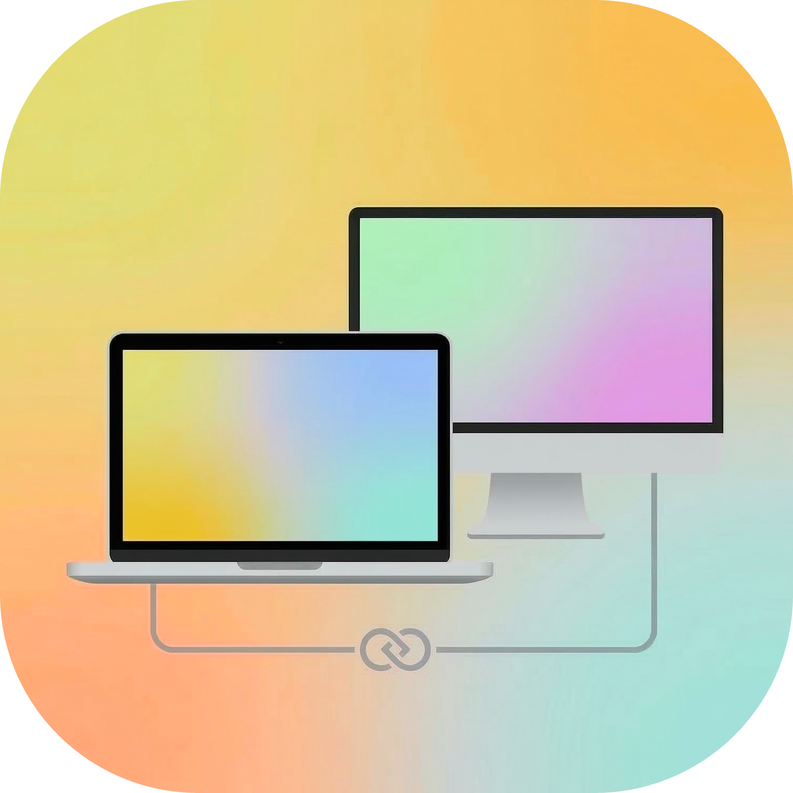
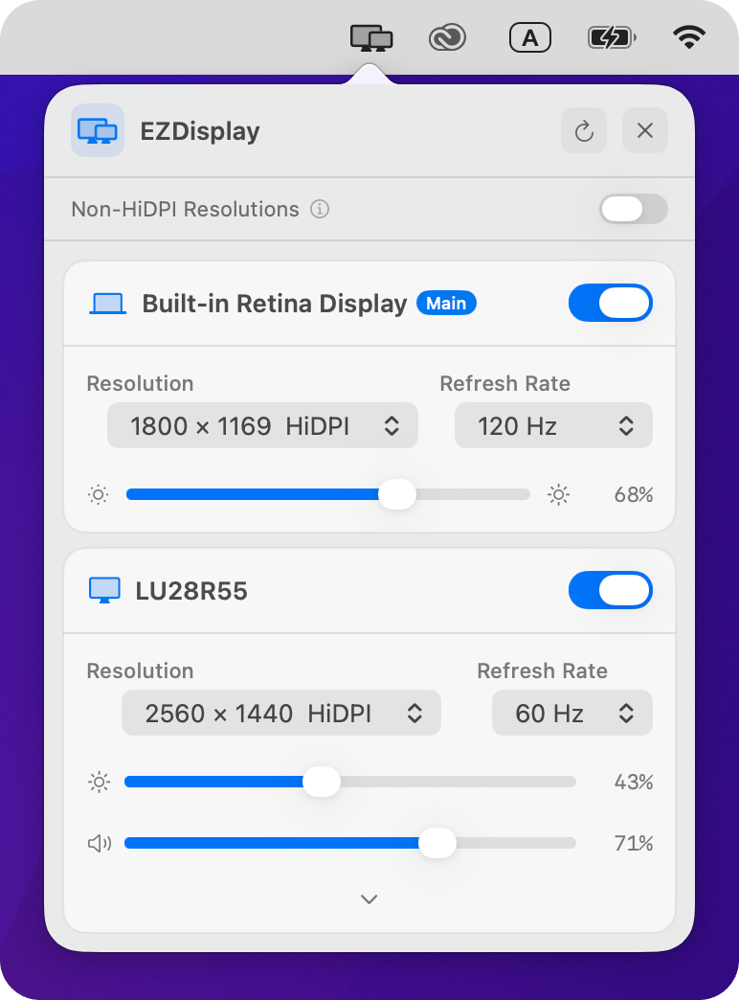

# EZMac

EZMac is a suite of utility applications for macOS, designed to enhance your system management experience.

</div>

## Applications

### EZDisplay

<div align="center">
  
</div>

EZDisplay is the first tool in the suite, focused on simplifying external display management. It is a part of the EZMac family.

<div align="center">
  
</div>

#### Features

- **Brightness Control:** Adjust the brightness of external monitors directly from your Mac, utilizing DDC/CI commands.
- **Resolution Switcher:** Quickly change display resolutions.
- **Menu Bar App:** Easily accessible controls from the macOS menu bar.

## Prerequisites

- macOS 11.0 or later.
- Xcode 13.0 or later (for building from source).

## Getting Started

To build and run the applications locally (starting with EZDisplay):

1. **Clone the repository:**
   ```bash
   git clone https://github.com/RXNova/ez-mac.git
   cd ez-mac
   ```

2. **Open the project in Xcode:**
   Double-click on `EZDisplay/EZDisplay.xcodeproj` or run:
   ```bash
   xed EZDisplay
   ```

3. **Build and Run:**
   - Select the **EZDisplay** scheme in the top toolbar to build EZDisplay.
   - Choose your Mac as the destination (My Mac).
   - Press `Cmd + R` or click the **Run** button (Play icon).

## Project Structure (EZDisplay)

- `EZDisplay/EZDisplay/App`: Application lifecycle and entry point (`EZDisplayApp.swift`).
- `EZDisplay/EZDisplay/Drivers`: Specific drivers for brightness control (DDC, Internal).
- `EZDisplay/EZDisplay/Services`: Core logic for managing displays and resolutions.
- `EZDisplay/EZDisplay/UI`: SwiftUI views for the user interface.
- `EZDisplay/EZDisplay/Models`: Data models for display configurations.
- `EZDisplay/EZDisplay/Bridging`: Objective-C bridging headers (IOKit).

## Permissions

The application may require permissions to control external displays via IOKit. Ensure you grant any prompted access rights when running the app.
